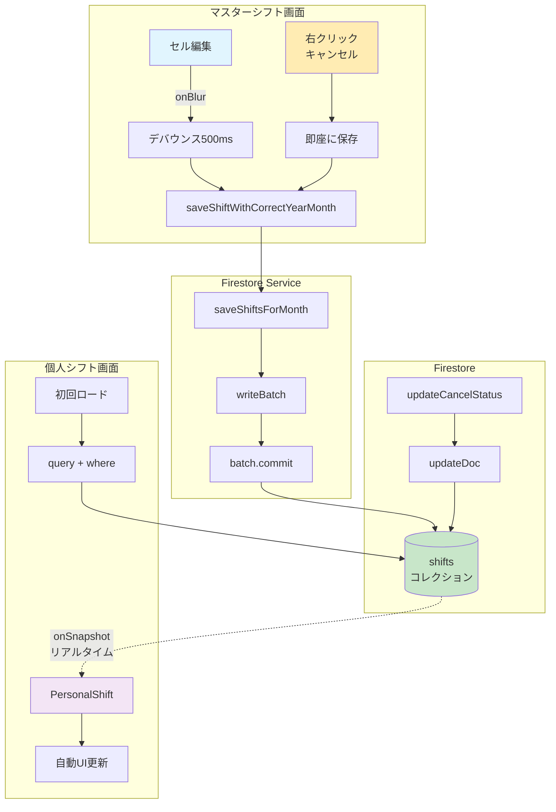

# シフト同期アーキテクチャの詳細調査結果

## 1. データの保存場所

### Firestoreコレクション構造
```
firestore
├── shifts/         # シフトデータ（メイン）
│   └── {shiftId}  # ID形式: shift-{helperId}-{date}-{rowIndex}
├── helpers/        # ヘルパー情報
│   └── {helperId}
├── dayOffRequests/ # 休み希望
├── scheduledDayOffs/ # 指定休
└── displayTexts/   # 表示テキスト
```

### データの共有
- **同一データソース**: マスターシフトと個人シフトは同じFirestoreの`shifts`コレクションを参照
- **フィルタリング**: 個人シフトはhelperId条件でフィルタリング

## 2. マスターシフト → Firestore保存処理

### 主要な保存タイミングと関数

#### A. セル編集時の自動保存（メイン）
**ファイル**: `src/components/ShiftTable.tsx`
**関数**: `onBlur`イベントハンドラ（4584行目～）
**処理フロー**:
```javascript
1. セルのフォーカスが外れる（onBlur）
2. 500msのデバウンス処理
3. saveShiftWithCorrectYearMonth(shift)を呼び出し
4. saveShiftsForMonth()でバッチ保存
```

**特徴**:
- **デバウンス**: 500ms後に自動保存
- **楽観的UI更新**: DOM更新を先に実行、その後Firestore保存
- **バッチ処理**: 複数の変更をまとめて保存

#### B. キャンセル処理時の保存
**ファイル**: `src/components/ShiftTable.tsx`
**関数**: 右クリックメニューの`cancelKeepTimeBtn.onclick`（3175行目～）
**処理フロー**:
```javascript
1. saveShiftWithCorrectYearMonth(shift) // 基本データ保存
2. updateCancelStatus(shiftId, 'canceled_with_time') // キャンセル状態更新
```

#### C. キャンセル取り消し時の保存
**ファイル**: `src/components/ShiftTable.tsx`
**関数**: 右クリックメニューの`undoCancelBtn.onclick`（2915行目～）
**処理フロー**:
```javascript
1. saveShiftWithCorrectYearMonth(shift) // 基本データ保存
2. updateCancelStatus(shiftId, 'none') // キャンセル状態削除
```

### 保存関数の詳細

#### `saveShiftWithCorrectYearMonth`
**ファイル**: `src/components/ShiftTable.tsx`（268行目）
```javascript
async function saveShiftWithCorrectYearMonth(shift: Shift): Promise<void> {
  const [shiftYear, shiftMonth] = shift.date.split('-').map(Number);
  await saveShiftsForMonth(shiftYear, shiftMonth, [shift]);
}
```

#### `saveShiftsForMonth`
**ファイル**: `src/services/firestoreService.ts`（136行目）
```javascript
export const saveShiftsForMonth = async (_year: number, _month: number, shifts: Shift[]): Promise<void> => {
  const batch = writeBatch(db);
  shifts.forEach(shift => {
    const shiftRef = doc(db, SHIFTS_COLLECTION, shift.id);
    // undefinedフィールドの削除処理
    if (!('cancelStatus' in shift) || shift.cancelStatus === undefined) {
      sanitizedData.cancelStatus = deleteField();
    }
    batch.set(shiftRef, sanitizedData);
  });
  await batch.commit();
}
```

## 3. Firestore → 個人シフト取得処理

### リアルタイム監視（onSnapshot）
**ファイル**: `src/components/PersonalShift.tsx`（129行目～）
**関数**: `useEffect`内の`onSnapshot`
```javascript
const unsubscribe = onSnapshot(
  q,
  { includeMetadataChanges: true }, // メタデータ変更も監視
  (snapshot) => {
    // リアルタイム更新処理
    const allShifts = snapshot.docs.map(doc => ({
      ...doc.data(),
      id: doc.id
    }));
    setShifts(fetchedShifts);
  }
);
```

**特徴**:
- **リアルタイム同期**: Firestoreの変更を即座に検知
- **メタデータ監視**: 保留中の書き込みも検知（`hasPendingWrites`）
- **自動再接続**: ネットワーク切断後も自動復旧

## 4. キャンセル関連フィールド

### Shift型のキャンセル関連フィールド（`src/types/index.ts`）
```typescript
interface Shift {
  // キャンセル関連
  cancelStatus?: 'none' | 'keep_time' | 'remove_time';  // キャンセル状態
  canceledAt?: any;       // キャンセル日時（Firestore Timestamp）

  // 削除関連（論理削除）
  deleted?: boolean;      // 論理削除フラグ
  deletedAt?: any;        // 削除日時
  deletedBy?: string;     // 削除者ID
}
```

### キャンセル状態の値
- **`undefined`または`'none'`**: 通常状態
- **`'keep_time'`**: キャンセル（時間残す）
- **`'remove_time'`**: キャンセル（時間削除）

## 5. キャンセル取り消し時の更新フィールド

### 更新処理（`src/utils/cancelUtils.ts`）
```javascript
// キャンセル取り消し時
if (newStatus === 'none') {
  updateData.cancelStatus = deleteField();  // フィールド削除
  updateData.canceledAt = deleteField();     // フィールド削除
}

// キャンセル設定時
else {
  updateData.cancelStatus = 'keep_time' or 'remove_time';
  updateData.canceledAt = serverTimestamp();
}
```

## 6. データフローダイアグラム



## 7. 問題点と改善案

### 現在の問題
1. **2段階保存の複雑性**: 基本データ保存とキャンセル状態更新が分離
2. **フィールド削除の不確実性**: `deleteField()`が期待通り動作しない場合がある

### 改善案
1. **トランザクション使用**: 複数の更新を1つのトランザクションで実行
2. **単一の更新関数**: すべてのフィールドを一度に更新
3. **エラーリトライ**: 失敗時の自動リトライ機構

## 8. デバッグのポイント

### コンソールログの確認箇所
1. **マスターシフト保存時**:
   - `💾 Firestore保存開始`
   - `✅ Firestore batch.commit()完了`

2. **個人シフト更新検知**:
   - `🔄 Firestore更新検知`
   - `⚠️ キャンセルフィールドが残っているシフト`

3. **キャンセル処理**:
   - `🗑️ キャンセルフィールドを削除`
   - `✅ キャンセル状態を設定`

### トラブルシューティング
1. **同期遅延**: `includeMetadataChanges: false`にして確認
2. **フィールド削除失敗**: Firebaseコンソールで直接確認
3. **権限エラー**: `auth.currentUser`の確認